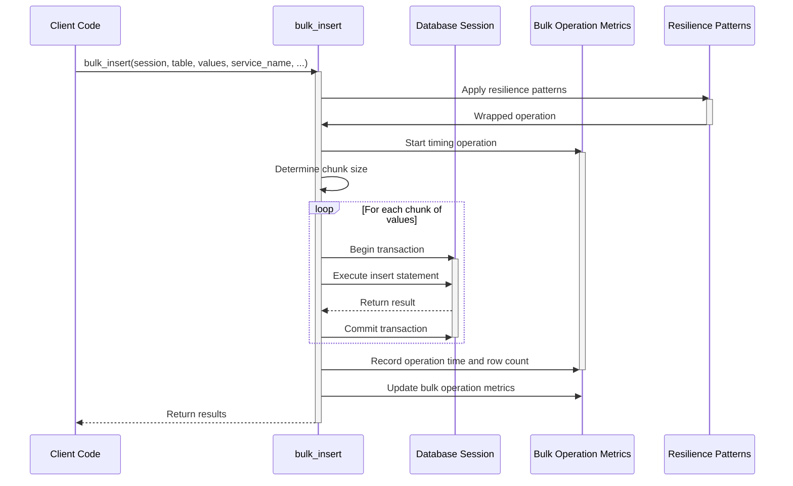

# Bulk Operations Sequence Diagram

This diagram shows the sequence of operations for performing a bulk insert operation.

## Sequence Description

1. **Client Calls Bulk Operation**: The client code calls `bulk_insert` with a session, table, values, and service name.

2. **Apply Resilience Patterns**: The operation is wrapped with resilience patterns like retries and circuit breakers.

3. **Start Metrics**: The bulk operation starts timing the operation.

4. **Chunk Determination**: The bulk operation determines the appropriate chunk size for the operation.

5. **Process Chunks**: For each chunk of values:
   - Begin a transaction
   - Execute the insert statement
   - Commit the transaction

6. **Record Metrics**: The bulk operation records the operation time and row count.

7. **Update Metrics**: Bulk operation metrics are updated to reflect the operation.

8. **Return Results**: The results are returned to the client.

## Variations

### Bulk Update

The sequence for `bulk_update` is similar, but uses update statements instead of insert statements.

### Bulk Delete

The sequence for `bulk_delete` is similar, but uses delete statements instead of insert statements.

### Asynchronous Operations

The asynchronous versions (`bulk_insert_async`, `bulk_update_async`, `bulk_delete_async`) follow the same sequence but use asynchronous database operations.

### Asyncpg Operations

The `bulk_insert_asyncpg` operation uses the asyncpg library directly for high-performance bulk inserts, potentially using the `copy_records_to_table` method for very large datasets.