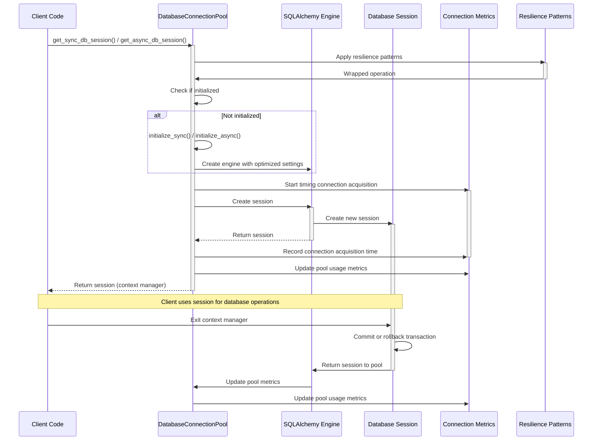

# Database Connection Sequence Diagram

This diagram shows the sequence of operations for acquiring and releasing a database connection.

## Sequence Description

1. **Client Requests Session**: The client code requests a database session using `get_sync_db_session()` or `get_async_db_session()`.

2. **Apply Resilience Patterns**: The operation is wrapped with resilience patterns like retries and circuit breakers.

3. **Check Initialization**: The connection pool checks if it has been initialized.

4. **Initialize if Needed**: If not initialized, the pool creates the database engine with optimized settings.

5. **Acquire Connection**: The pool acquires a connection from the engine, measuring the time it takes.

6. **Create Session**: The engine creates a new session and returns it to the pool.

7. **Return Session**: The pool returns the session to the client as a context manager.

8. **Client Uses Session**: The client uses the session for database operations.

9. **Session Cleanup**: When the client exits the context manager, the session is committed or rolled back.

10. **Return to Pool**: The session is returned to the connection pool.

11. **Update Metrics**: Connection pool metrics are updated to reflect the current state.