# Database Utilities Component Diagram

This diagram shows the architecture of the database utilities in the common-lib package.

```mermaid
graph TD
    %% Main Components
    Client[Client Code] --> ConnectionPool[Connection Pool]
    Client --> PreparedStatements[Prepared Statements]
    Client --> BulkOperations[Bulk Operations]
    Client --> Monitoring[Monitoring]
    
    %% Connection Pool Components
    ConnectionPool --> SyncEngine[Synchronous Engine]
    ConnectionPool --> AsyncEngine[Asynchronous Engine]
    ConnectionPool --> AsyncpgPool[Asyncpg Pool]
    ConnectionPool --> ConnectionMetrics[Connection Metrics]
    
    %% Prepared Statements Components
    PreparedStatements --> StatementCache[Statement Cache]
    PreparedStatements --> StatementExecution[Statement Execution]
    PreparedStatements --> StatementMetrics[Statement Metrics]
    
    %% Bulk Operations Components
    BulkOperations --> BulkInsert[Bulk Insert]
    BulkOperations --> BulkUpdate[Bulk Update]
    BulkOperations --> BulkDelete[Bulk Delete]
    BulkOperations --> BulkMetrics[Bulk Operation Metrics]
    
    %% Monitoring Components
    Monitoring --> QueryPerformance[Query Performance]
    Monitoring --> TransactionTracking[Transaction Tracking]
    Monitoring --> QueryAnalysis[Query Analysis]
    Monitoring --> HealthChecks[Health Checks]
    
    %% Connections between components
    SyncEngine --> StatementExecution
    AsyncEngine --> StatementExecution
    AsyncpgPool --> StatementExecution
    
    BulkInsert --> SyncEngine
    BulkInsert --> AsyncEngine
    BulkInsert --> AsyncpgPool
    BulkUpdate --> SyncEngine
    BulkUpdate --> AsyncEngine
    BulkDelete --> SyncEngine
    BulkDelete --> AsyncEngine
    
    QueryPerformance --> ConnectionMetrics
    QueryPerformance --> StatementMetrics
    QueryPerformance --> BulkMetrics
    
    %% External Dependencies
    SyncEngine --> SQLAlchemy[SQLAlchemy]
    AsyncEngine --> SQLAlchemyAsync[SQLAlchemy Async]
    AsyncpgPool --> Asyncpg[Asyncpg]
    
    %% Resilience Components
    ConnectionPool --> Resilience[Resilience Patterns]
    PreparedStatements --> Resilience
    BulkOperations --> Resilience
    Monitoring --> Resilience
    
    %% Metrics Integration
    ConnectionMetrics --> PrometheusMetrics[Prometheus Metrics]
    StatementMetrics --> PrometheusMetrics
    BulkMetrics --> PrometheusMetrics
    QueryPerformance --> PrometheusMetrics
    
    %% Class definitions
    classDef component fill:#f9f,stroke:#333,stroke-width:2px;
    classDef external fill:#bbf,stroke:#333,stroke-width:2px;
    classDef metrics fill:#bfb,stroke:#333,stroke-width:2px;
    
    %% Apply classes
    class ConnectionPool,PreparedStatements,BulkOperations,Monitoring component;
    class SQLAlchemy,SQLAlchemyAsync,Asyncpg external;
    class ConnectionMetrics,StatementMetrics,BulkMetrics,PrometheusMetrics,QueryPerformance metrics;
```

## Component Descriptions

### Connection Pool
- **DatabaseConnectionPool**: Manages database connections for services
- **Synchronous Engine**: SQLAlchemy engine for synchronous operations
- **Asynchronous Engine**: SQLAlchemy async engine for asynchronous operations
- **Asyncpg Pool**: Direct asyncpg connection pool for high-performance operations
- **Connection Metrics**: Metrics for connection pool usage and performance

### Prepared Statements
- **Statement Cache**: Caches prepared statements for reuse
- **Statement Execution**: Executes prepared statements with parameters
- **Statement Metrics**: Metrics for prepared statement execution

### Bulk Operations
- **Bulk Insert**: Efficiently inserts multiple rows at once
- **Bulk Update**: Efficiently updates multiple rows at once
- **Bulk Delete**: Efficiently deletes multiple rows at once
- **Bulk Metrics**: Metrics for bulk operation performance

### Monitoring
- **Query Performance**: Tracks query execution time and resource usage
- **Transaction Tracking**: Monitors database transactions
- **Query Analysis**: Analyzes query execution plans
- **Health Checks**: Checks database health and connectivity

### External Dependencies
- **SQLAlchemy**: ORM and SQL toolkit for Python
- **SQLAlchemy Async**: Asynchronous extension for SQLAlchemy
- **Asyncpg**: High-performance PostgreSQL client library for Python

### Cross-Cutting Concerns
- **Resilience Patterns**: Circuit breakers, retries, and timeouts
- **Prometheus Metrics**: Integration with Prometheus for monitoring