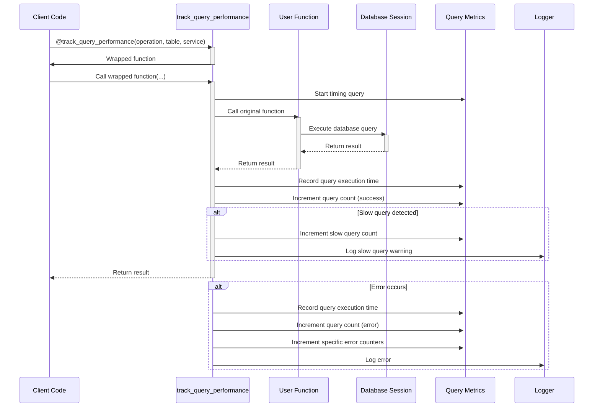

# Database Monitoring Sequence Diagram

This diagram shows the sequence of operations for monitoring database query performance.

## Sequence Description

1. **Decorator Application**: The client code applies the `@track_query_performance` decorator to a function.

2. **Function Wrapping**: The decorator wraps the function and returns it.

3. **Function Call**: The client calls the wrapped function.

4. **Start Timing**: The decorator starts timing the query execution.

5. **Original Function Call**: The decorator calls the original function.

6. **Database Query**: The function executes a database query using the session.

7. **Result Return**: The result is returned to the decorator.

8. **Metrics Recording**: The decorator records the query execution time and increments the query count.

9. **Slow Query Detection**: If the query took longer than the slow query threshold, the decorator increments the slow query count and logs a warning.

10. **Result Return**: The result is returned to the client.

11. **Error Handling**: If an error occurs, the decorator records the error metrics and logs the error.

## Variations

### Transaction Tracking

The `track_transaction` decorator follows a similar sequence but tracks the entire transaction rather than a single query.

### Query Analysis

The `analyze_query` function executes an `EXPLAIN ANALYZE` query to get the query execution plan and performance statistics.

### Health Checks

The `check_database_health` function executes a series of queries to check the health of the database, including connectivity, version, connection count, and active queries.