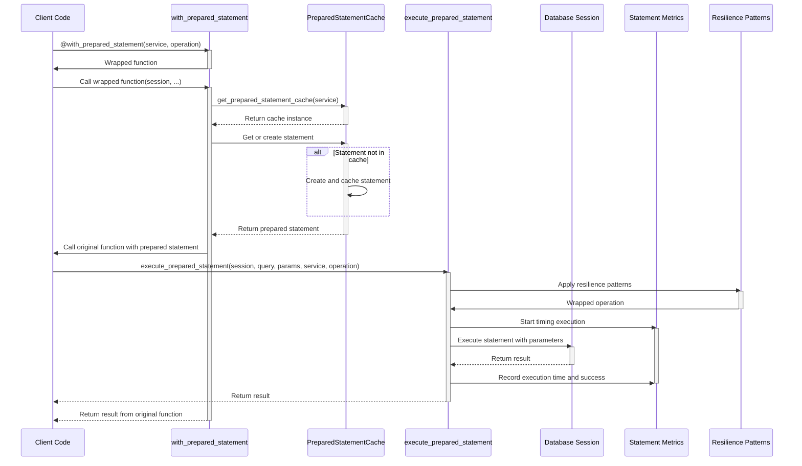

# Prepared Statement Sequence Diagram

This diagram shows the sequence of operations for executing a prepared statement.

## Sequence Description

1. **Decorator Application**: The client code applies the `@with_prepared_statement` decorator to a function.

2. **Function Wrapping**: The decorator wraps the function and returns it.

3. **Function Call**: The client calls the wrapped function with a database session and other parameters.

4. **Cache Retrieval**: The decorator gets the prepared statement cache for the service.

5. **Statement Preparation**: The decorator gets or creates a prepared statement from the cache.

6. **Original Function Call**: The decorator calls the original function with the prepared statement.

7. **Statement Execution**: The client calls `execute_prepared_statement` with the session, query, and parameters.

8. **Apply Resilience**: The execution is wrapped with resilience patterns like retries and circuit breakers.

9. **Metrics Start**: The executor starts timing the execution.

10. **Database Execution**: The executor executes the statement with parameters using the session.

11. **Metrics Recording**: The executor records the execution time and success/failure.

12. **Result Return**: The result is returned through the execution chain back to the client.