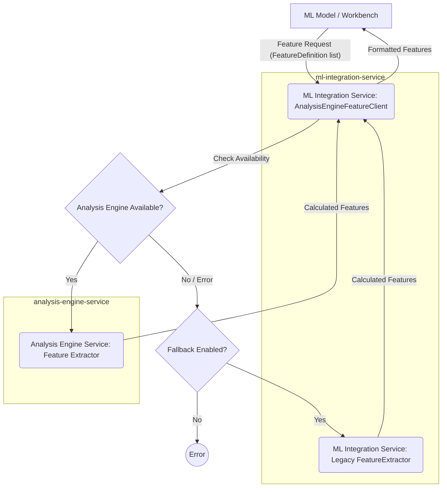

# ML Integration Service

This service acts as a bridge between the core trading platform components (like the Analysis Engine and Data Pipeline) and the machine learning model development and execution environments (like the ML Workbench).

Its primary responsibilities include:

*   **Feature Extraction:** Providing a consistent interface for ML models to request and receive features calculated by the `analysis-engine-service`.
*   **Data Formatting:** Ensuring data (OHLCV, features) is in the format expected by ML models.
*   **Model Interaction:** (Potentially) Handling loading, prediction requests, and interpretation of results for deployed ML models.

## Key Components

### Caching System

The ML Integration Service includes a comprehensive caching system to improve performance and reduce computational load:

* **Model Inference Caching:** Results of model predictions are cached to avoid redundant computations for the same inputs.
* **Feature Vector Caching:** Extracted feature vectors are cached to speed up repeated model inference requests.
* **Cache Monitoring:** A dashboard is available to monitor cache performance and manage cached data.

#### Cache Configuration

The caching system can be configured through environment variables:

```python
# Default cache TTL (time-to-live) in seconds
CACHE_TTL=1800  # 30 minutes

# Enable/disable caching
ENABLE_CACHING=true

# Maximum cache size (number of entries)
MAX_CACHE_SIZE=1000
```

#### Cache Monitoring Dashboard

A web-based dashboard is available to monitor cache performance:

```
http://localhost:8080/api/dashboard/cache
```

The dashboard provides:
* Real-time statistics on cache usage
* Cache hit/miss rates
* Cache entry distribution
* Tools to clear specific parts of the cache

#### Cache API Endpoints

The following API endpoints are available for programmatic cache management:

* `GET /api/v1/cache/stats` - Get cache statistics
* `POST /api/v1/cache/clear` - Clear cache entries

#### Caching Decorators

The service provides decorators to easily add caching to any function:

```python
from ml_integration_service.caching import cache_model_inference, cache_feature_vector

# Cache model inference results
@cache_model_inference(ttl=1800)  # Cache for 30 minutes
def predict(self, model_id: str, symbol: str, timeframe: str, features: pd.DataFrame):
    # Model inference code here
    pass

# Cache feature vector generation
@cache_feature_vector(ttl=1800)  # Cache for 30 minutes
def extract_features(self, model_name: str, symbol: str, timeframe: str, data: pd.DataFrame):
    # Feature extraction code here
    pass
```

### `AnalysisEngineFeatureClient`

Located in `ml_integration_service/analysis_engine_client.py`.

This is the primary client for accessing features calculated by the `analysis-engine-service`. It offers:

*   **Unified Interface:** Allows ML components to request features using `FeatureDefinition` objects.
*   **Analysis Engine Integration:** Connects to the `analysis-engine-service` (either via direct import if available or potentially via API in the future) to leverage its centralized feature calculation logic.
*   **Fallback Mechanism:** Can optionally fall back to a legacy feature extraction implementation (`ml_integration_service.feature_extraction.FeatureExtractor`) if the `analysis-engine-service` is unavailable or encounters errors, ensuring robustness.
*   **Timeframe Handling:** Supports requesting features for a specific `target_timeframe`.

#### Configuration

The client is initialized as follows:

```python
from ml_integration_service.analysis_engine_client import AnalysisEngineFeatureClient

# Initialize with default settings (use Analysis Engine if available, fallback enabled)
client = AnalysisEngineFeatureClient()

# Initialize to force fallback mode (e.g., for testing or if AE is known to be down)
client_fallback = AnalysisEngineFeatureClient(direct_mode=False, use_fallback=True)

# Initialize without fallback (will raise errors if Analysis Engine is unavailable)
client_no_fallback = AnalysisEngineFeatureClient(use_fallback=False)
```

#### Usage Example

```python
import pandas as pd
from ml_integration_service.analysis_engine_client import AnalysisEngineFeatureClient
from ml_integration_service.feature_extraction import FeatureDefinition, FeatureType

# Assume 'ohlcv_data' is a pandas DataFrame with OHLCV data
# Assume 'client' is an initialized AnalysisEngineFeatureClient

feature_defs = [
    FeatureDefinition(
        name="rsi_14",
        indicator_name="rsi",
        output_column="rsi_14",
        feature_type=FeatureType.MOMENTUM,
        parameters={"window": 14, "column": "close"},
        description="14-period Relative Strength Index"
    ),
    FeatureDefinition(
        name="sma_50_4H",
        indicator_name="sma",
        output_column="sma_50",
        feature_type=FeatureType.TREND,
        parameters={"window": 50, "column": "close", "timeframe": "4H"}, # Specify source timeframe if needed
        description="50-period Simple Moving Average (intended for 4H)"
    )
]

# Extract features on the base timeframe of the data
features_base = client.extract_features(ohlcv_data, feature_defs)

# Extract features, requesting results aligned to a 4H timeframe
features_4h = client.extract_features(ohlcv_data, feature_defs, target_timeframe='4H')
```

Refer to the [Developer Feature Guide](../../docs/developer/FeatureGuide.md) for more detailed examples.

### `feature_extraction.py`

Contains legacy feature extraction code (`FeatureExtractor`) and data structures like `FeatureDefinition` used for requesting features.

## Data Flow (Conceptual)


*(This diagram shows the conceptual flow. See architecture diagrams for detailed service interactions.)*

## Development

Setup and testing instructions specific to this service.

```bash
# Example setup commands (adjust as needed)
cd ml-integration-service
# Install dependencies (assuming poetry or similar)
poetry install

# Run unit tests
pytest tests/
```

## Contributing

Please refer to the main project's contribution guidelines.
