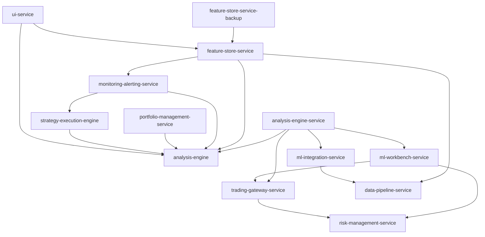

# Forex Trading Platform Architecture Overview

*Generated on 2025-05-13 05:58:22*

## Introduction

The Forex Trading Platform is a comprehensive system for forex trading, analysis, and portfolio management. It follows a microservices architecture with clear separation of concerns and standardized interfaces for service interactions.

## Architecture Principles

1. **Microservices Architecture**: The platform is composed of independent services, each with a specific responsibility.
2. **Interface-Based Design**: Services interact through well-defined interfaces, reducing direct coupling.
3. **Standardized Error Handling**: Consistent error handling across all services with correlation IDs for request tracing.
4. **Resilience Patterns**: Circuit breaker and retry with exponential backoff for all service interactions.
5. **Dependency Injection**: Adapter factories for dependency injection in all services.

## Services

The platform consists of 16 services:

- **analysis-engine**: Service for analysis engine functionality.
- **analysis-engine-service**: ## Overview
The Analysis Engine Service is a core component of the Forex Trading Platform responsible for performing advanced time-series analysis on market data. This service provides analytical capabilities including pattern recognition, technical indicators, and data transformations needed by other platform services.
- **api-gateway**: Service for api gateway functionality.
- **data-management-service**: A comprehensive service for managing historical data for forex trading.
- **data-pipeline-service**: Service for data pipeline functionality.
- **feature-store-service**: ## Overview
The Feature Store Service is a centralized repository for storing, managing, and serving features used in the Forex Trading Platform. It acts as the canonical source for all indicator implementations, providing consistent data access patterns for machine learning models and analysis components.
- **feature-store-service-backup**: Service for feature store backup functionality.
- **ml-integration-service**: This service acts as a bridge between the core trading platform components (like the Analysis Engine and Data Pipeline) and the machine learning model development and execution environments (like the ML Workbench).
- **ml-workbench-service**: ## Overview
The ML Workbench Service is a specialized environment for developing, training, and deploying machine learning models for forex trading applications. It provides a unified interface for data scientists and quants to experiment with ML-based trading strategies and integrate them with the platform's trading infrastructure.
- **model-registry-service**: A dedicated service for managing machine learning model versioning, deployment, and lifecycle in the Forex Trading Platform.
- **monitoring-alerting-service**: ## Overview
The Monitoring & Alerting Service is responsible for tracking, analyzing, and reporting on the health and performance of the Forex Trading Platform. It provides real-time monitoring, alerting capabilities, metrics collection, and visualization dashboards to ensure system reliability and performance.
- **portfolio-management-service**: ## Overview
The Portfolio Management Service is responsible for tracking, analyzing, and optimizing forex trading portfolios within the platform. It provides position tracking, portfolio analytics, risk assessment, and performance reporting to ensure effective capital management and investment strategy evaluation.
- **risk-management-service**: This service provides risk assessment, limit enforcement, and monitoring capabilities for the Forex Trading Platform.
- **strategy-execution-engine**: ## Overview
The Strategy Execution Engine is a critical component of the Forex Trading Platform responsible for executing trading strategies based on market data and analytical signals. It provides a framework for strategy definition, backtesting, optimization, and live execution.
- **trading-gateway-service**: ## Overview
The Trading Gateway Service serves as the interface between the Forex Trading Platform and various external trading providers and exchanges. It provides a unified API for executing trades, retrieving market data, and managing orders across multiple brokers and liquidity providers.
- **ui-service**: ## Overview
The UI Service provides the frontend interface for the Forex Trading Platform. It offers a modern, responsive web application for traders, analysts, and administrators to interact with the platform's features, monitor market data, execute trades, and analyze performance.

## Service Dependencies

The following diagram shows the dependencies between services:

## Interfaces

The platform uses the following interfaces for service interactions:

- **AnalysisEngineInterface**: Interface for analysis-engine service.
- **AnalysisEngineServiceInterface**: Interface for analysis-engine-service service.
- **ApiGatewayInterface**: Interface for api-gateway service.
- **DataManagementServiceInterface**: Interface for data-management-service service.
- **DataPipelineServiceInterface**: Interface for data-pipeline-service service.
- **FeatureStoreServiceBackupInterface**: Interface for feature-store-service-backup service.
- **FeatureStoreServiceInterface**: Interface for feature-store-service service.
- **MlIntegrationServiceInterface**: Interface for ml-integration-service service.
- **MlWorkbenchServiceInterface**: Interface for ml-workbench-service service.
- **ModelRegistryServiceInterface**: Interface for model-registry-service service.
- **MonitoringAlertingServiceInterface**: Interface for monitoring-alerting-service service.
- **PortfolioManagementServiceInterface**: Interface for portfolio-management-service service.
- **RiskManagementServiceInterface**: Interface for risk-management-service service.
- **StrategyExecutionEngineInterface**: Interface for strategy-execution-engine service.
- **TradingGatewayServiceInterface**: Interface for trading-gateway-service service.
- **UiServiceInterface**: Interface for ui-service service.

## Standard Directory Structure

Each service follows a standardized directory structure:

- **api**: API routes and controllers
- **config**: Configuration files
- **core**: Core business logic
- **models**: Data models and schemas
- **repositories**: Data access layer
- **services**: Service implementations
- **utils**: Utility functions
- **adapters**: Adapters for external services
- **interfaces**: Interface definitions
- **tests**: Unit and integration tests
