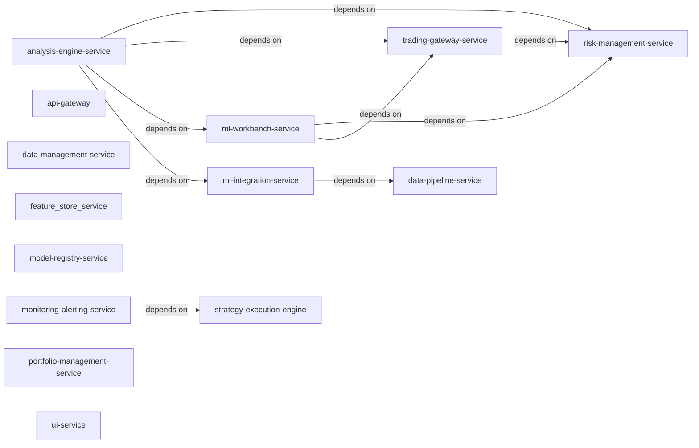

```mermaid
graph LR;
  analysis-engine-service["analysis-engine-service"];
  api-gateway["api-gateway"];
  data-management-service["data-management-service"];
  data-pipeline-service["data-pipeline-service"];
  feature_store_service["feature_store_service"];
  ml-integration-service["ml-integration-service"];
  ml-workbench-service["ml-workbench-service"];
  model-registry-service["model-registry-service"];
  monitoring-alerting-service["monitoring-alerting-service"];
  portfolio-management-service["portfolio-management-service"];
  risk-management-service["risk-management-service"];
  strategy-execution-engine["strategy-execution-engine"];
  trading-gateway-service["trading-gateway-service"];
  ui-service["ui-service"];
  analysis-engine-service -->|depends on| risk-management-service;
  analysis-engine-service -->|depends on| trading-gateway-service;
  analysis-engine-service -->|depends on| ml-workbench-service;
  analysis-engine-service -->|depends on| ml-integration-service;
  ml-integration-service -->|depends on| data-pipeline-service;
  ml-workbench-service -->|depends on| risk-management-service;
  ml-workbench-service -->|depends on| trading-gateway-service;
  monitoring-alerting-service -->|depends on| strategy-execution-engine;
  trading-gateway-service -->|depends on| risk-management-service;
```